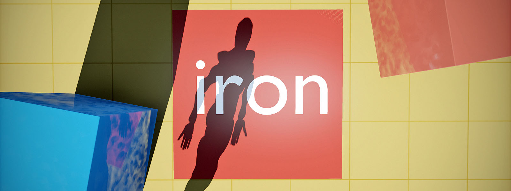

# Welcome

Iron is a data-based, asynchronous engine for building portable 3D tools using [Kha](https://github.com/Kode/Kha), [Haxe](https://github.com/HaxeFoundation/haxe) and [WebAssembly](http://webassembly.org/). It is powering [Armory](http://armory3d.org), but is structured to run stand-alone.

Iron handles render & content pipelines and lets you develop a custom visual engine on top of it.

- [Get Iron](https://github.com/armory3d/iron)
- [Examples](https://github.com/armory3d/iron_examples/)
- [Setup](./getting_started/setup.md)

---

Useful tooling:
- [Haxebullet](https://github.com/armory3d/haxebullet) for 3D physics
- [Haxerecast](https://github.com/armory3d/haxerecast) for 3D navigation
- [HaxeUI](https://github.com/haxeui/haxeui-kha) to build user interfaces
- [Zui](https://github.com/armory3d/zui) for debug interfaces
- [iron_format](https://github.com/armory3d/iron_format) for 3D model import
- [KodeStudio](https://github.com/Kode/KodeStudio/releases) as IDE
- [Krom](https://github.com/Kode/Krom) for deployment
