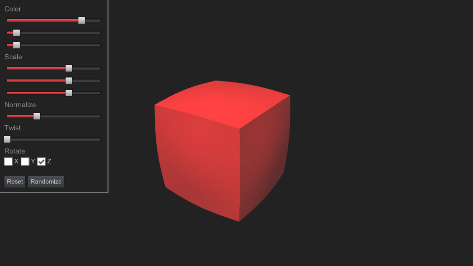

# Setup

*Note: as is apparent, the examples & docs are work in progress*

## Quick start
- git clone --recursive https://github.com/armory3d/iron_examples
- Drop one of the example folders into [KodeStudio](https://github.com/Kode/KodeStudio/releases)
- Run



## Content pipeline

Iron does not import standard 3D file formats directly. Instead, a custom scene format is developed for efficiency & performance in real-time rendering. The format is originally based on the [opengex](http://opengex.org) specification. See structure view of the [scene format](https://github.com/armory3d/iron/blob/master/Sources/iron/data/SceneFormat.hx).

To import model data, [mesh exporter](https://github.com/armory3d/iron/blob/master/tools/exporter.py) for Blender is provided. Blender can also be operated from command line, making it possible to use any content creation tools desired and integrate Blender as asset converter.

JSON (textual, for debug) or MessagePack (binary, for deploy) serialization is used. Compressed blobs (currently zip) are supported.

On top of this, full asset processing features of Kha are employed.

## Render pipeline

Shaders are cross-compiled and written in modern glsl syntax using the [krafix](https://github.com/Kode/krafix) tooling.

The render-path is fully programmable. You can build renderer by hand or build a script to generate it automatically. In case of Armory, render-path is built visually using nodes.

A minimal deferred renderer:

```
{
    "renderpath_datas": [
        {
            "name": "deferred",
            "depth_buffers": [
                {
                    "name": "main",
                    "stencil_buffer": false
                }
            ],
            "render_targets": [
                {
                    "name": "gbuffer0",
                    "depth_buffer": "main",
                    "format": "RGBA64",
                    "width": 0,
                    "height": 0
                },
                {
                    "name": "gbuffer1",
                    "format": "RGBA64",
                    "width": 0,
                    "height": 0
                }
            ],
            "stages": [
                {
                    "command": "set_target",
                    "params": [
                        1.0,
                        "gbuffer0",
                        "gbuffer1"
                    ]
                },
                {
                    "command": "clear_target",
                    "params": [
                        "color",
                        "#ff000000",
                        "depth",
                        "1.0"
                    ]
                },
                {
                    "command": "draw_meshes",
                    "params": [
                        "mesh",
                        "front_to_back"
                    ]
                },
                {
                    "command": "set_target",
                    "params": [
                        1.0,
                        ""
                    ]
                },
                {
                    "command": "bind_target",
                    "params": [
                        "_main",
                        "gbufferD",
                        "gbuffer0",
                        "gbuffer0",
                        "gbuffer1",
                        "gbuffer1"
                    ]
                },
                {
                    "command": "draw_shader_quad",
                    "params": [
                        "deferred_indirect/deferred_indirect/deferred_indirect"
                    ]
                },
                {
                    "command": "loop_lamps",
                    "params": [],
                    "returns_true": [
                        {
                            "command": "set_target",
                            "params": [
                                1.0,
                                ""
                            ]
                        },
                        {
                            "command": "bind_target",
                            "params": [
                                "_main",
                                "gbufferD",
                                "gbuffer0",
                                "gbuffer0",
                                "gbuffer1",
                                "gbuffer1"
                            ]
                        },
                        {
                            "command": "draw_lamp_volume",
                            "params": [
                                "deferred_light/deferred_light/deferred_light"
                            ]
                        }
                    ]
                }
            ]
        }
    ]
}
```

